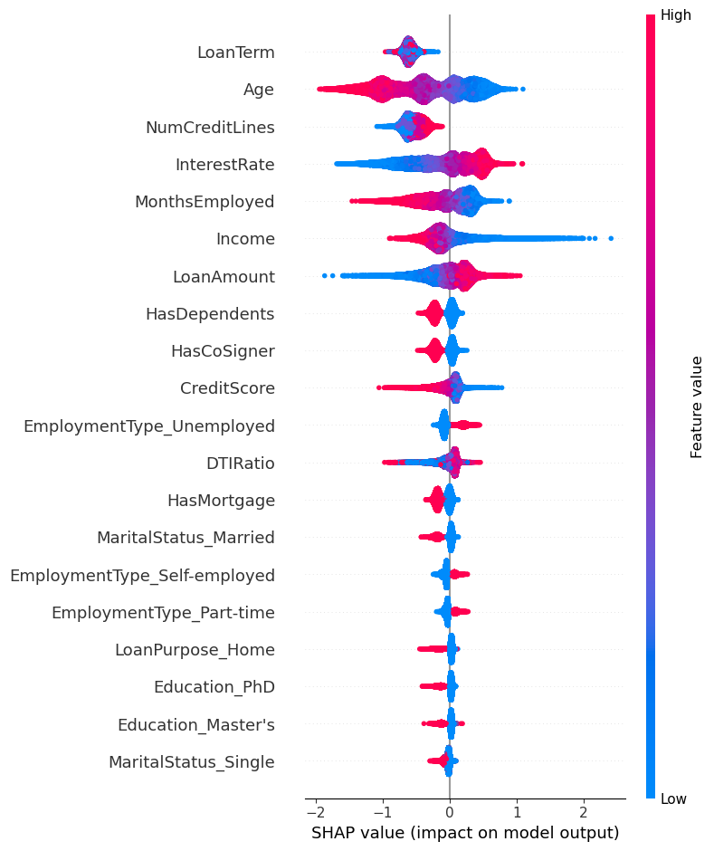

# 🏦 Loan Default Risk Modeling

This project uses machine learning techniques to predict the likelihood of a loan default. The goal is to assist financial institutions in minimizing lending risks by identifying high-risk applicants early in the process.

## 📌 Problem Statement

Financial institutions need accurate tools to assess whether a loan applicant is likely to default. Traditional methods may lack the predictive power that ML models can provide. This project aims to build an interpretable and effective classification model for loan default prediction.

## 🧰 Tools & Libraries

- Python
- pandas, numpy, seaborn, matplotlib
- scikit-learn
- XGBoost
- SMOTE (imbalanced-learn)
- SHAP (SHapley Additive exPlanations)

## 📈 Approach

1. **Exploratory Data Analysis (EDA)**:
   - Checked data types, null values, distributions
   - Visualized key features: Age, Income, Loan Amount, Credit Score

2. **Data Preprocessing**:
   - Label encoding for binary variables
   - One-hot encoding for categorical variables
   - Handled class imbalance using SMOTE

3. **Modeling**:
   - Logistic Regression as a baseline
   - XGBoost for advanced performance
   - Achieved ~82% accuracy on test data

4. **Interpretability**:
   - Used SHAP values to interpret model predictions
   - Identified key risk drivers: Applicant Income, Loan Amount, Credit Score

## 🔍 Key Insights

- **SMOTE improved recall** for default class by over **20%**
- **SHAP analysis** helped identify influential features
- Final model is both **accurate and interpretable**, aiding stakeholder trust

## 📊 Visuals



## 📝 Recommendations

- Enhance credit policies using top features like Credit Score, Loan Amount, and Applicant Income
- Apply additional risk filters for applicants with high default probability

## 🚀 Getting Started

Clone the repo and install dependencies:

```bash
git clone https://github.com/yourusername/Loan-Default-Risk-Modeling.git
cd Loan-Default-Risk-Modeling
pip install -r requirements.txt
